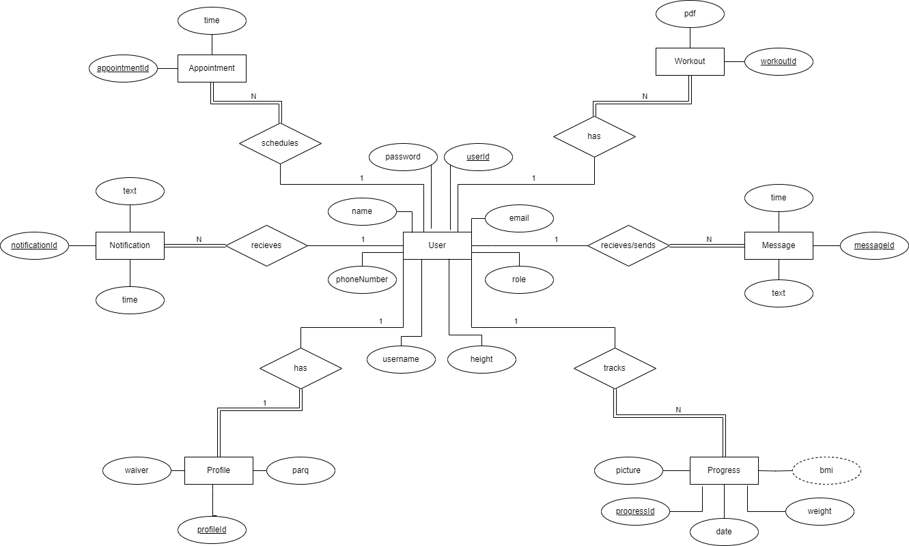

  

   

# MKFit
This application will facilitate communication between trainers and  clients, simplifying the tracking progress; our goal is not to replace existing apps like MyFitnessPal, but to complement them. 
By focusing on monitoring BMI, updating progress photos, introducing new workout routines, and maintaining transparency, trainers can easily monitor their clients' exercises, track their progress over time, and make necessary adjustments to their exercise routines. 

## Table of Contents
---
- [Table of Contents](#table-of-contents)
- [Team Members](#team-members)
- [Background](#background)
- [Solution](#solution)
- [Prototype](#prototype)
- [Timeline](#timeline)
- [Website Demo](#website-demo)
- [Testing](#testing)
- [Deployment](#deployment)
- [Developer Instructions](#developer-instructions)

## Team Members
---
- [Stephanie Nutter](https://github.com/S-nutter)
- [Michael Partridge](https://github.com/LikableMike)
- [Ramin Selseleh](https://github.com/RaminSel)
- [Christian Vela Pasillas](https://github.com/christianvelapasill)
- [Phillip Avila](https://github.com/APEX226)
- [Nicholas Gaudet](https://github.com/ng262)
- [Isaiah Samaniego]
- [Brian Hert]

## Background
---

Makayla is an independent personal trainer based out of Woodland California. Her training business MK Fit provides one-on-one training in physical fitness for people of all ages. Makayla often works through her local gym to find clients who are looking to start their workout journey and assists in finding the right exercises for them.  Furthermore, she offers dietary advice so that customers achieve the greatest results possible.

## Solution
---
Creating a tailored mobile app based our clients business model, customer base and challenges they face. This tailored approach ensures that the app addresses the specific problems faced by our client in order to create a positive impact on their business. 

## Prototype
---
During the begenning phase of our creating this application, we utilized flutter-flow to create our prototype of what the app will look like and its functions. Below, are the first pages we created based on our clients vision, to showcase what the app would closely look like.   

The following pages were created:
<ul style="circle">
   <li>Sign In and Sign Up page</li>
   <li>Create Account Page</li>
   <li>Settings Page Page</li>
   <li>Forgot Password Page</li>
   <li>Confirm New Password Page</li>
   <li>Forgot Username Page</li>
   <li>Confirm New Username Page</li>
  <li>Calender / Appointment Page</li>
  <li>Progress Tracking Page</li>
  <li>Personlized Workout page</li>
  <li>Chat Option</li>
  <li>Progress Tracking Page</li>
  <li>Main Page</li>
</ul>   

## Application Demo
---

https://github.com/LikableMike/MKFit/assets/118847632/50e03ad5-39dc-40b0-9c62-503eb83be408

## ERD
---

  

   

   
## Timeline
---
<b>Febrary 2024:</b> Charter completion and project confirmation.

<b>March 2024:</b> Base Flutter demo completion.

<b>April 2024:</b> Began front end with account creation, login, passwords pages.

<b>May 2024:</b> Functional front end for users nearing completion. Front page integration, ability to view worksouts as a PDF, calendars.

Estimation for CSC 191:

<b>Sprint 5</b> (August 26th-September 8th 2024):
- Begin back end implementaion.
- Begin database implementation.
  	- This will allow for the eventual completion of calendar and login features, as well as store workout plan PDFs.
- Design and implement Settings page.
- Begin giving buttons actions on the Account and Appointment pages.
  	- Account pages allow users to input their BMI, weight, height, username, and post an account picture.

<b>Sprint 6</b> (September 9th-September 22nd 2024):
- Continue with Account and Appointment implementation.
  	- Appointment pages link back to calendar implementation.
- Begin Chat function.
- Complete "Daily Motivation" tool.
  	- Admins can use this tool to post messages.

<b>Sprint 7</b> (September 23rd - October 6th 2024):
- Begin development of admin features.
	- Administrators can alter workouts, post movies, send messages and payment requests.
- Begin development of the workout page.
- Begin giving functionality to the Workout page.
  	- On this page, users will be able to add in which exercises they are doing and how many reps.
  	- Administrators have access to this page and can edit it.

<b>Sprint 8</b> (October 7th - October 20th):
- Continue the implementation of Admin Features.
- Create and implement the Administrator's exercise list and workout database.
- Complete tasks from any previous Sprints left unfinished and begin testing.

<b>Sprint 9</b>(October 21st-November 3rd 2024):
- Function testing.

## Testing
---

Testing will be added next semester   

## Deployment
---

Deployement instructions will be added next semester   

## Developer Instructions
---

Developer instructions will be added next semester

## Getting Started

The current build of the app is able to run on an Android Phone Emulator using Flutter. With Android Studio, while an emulator device is running, typing "flutter run" into the terminal should build and run the app as long as flutter is correctly installed.
